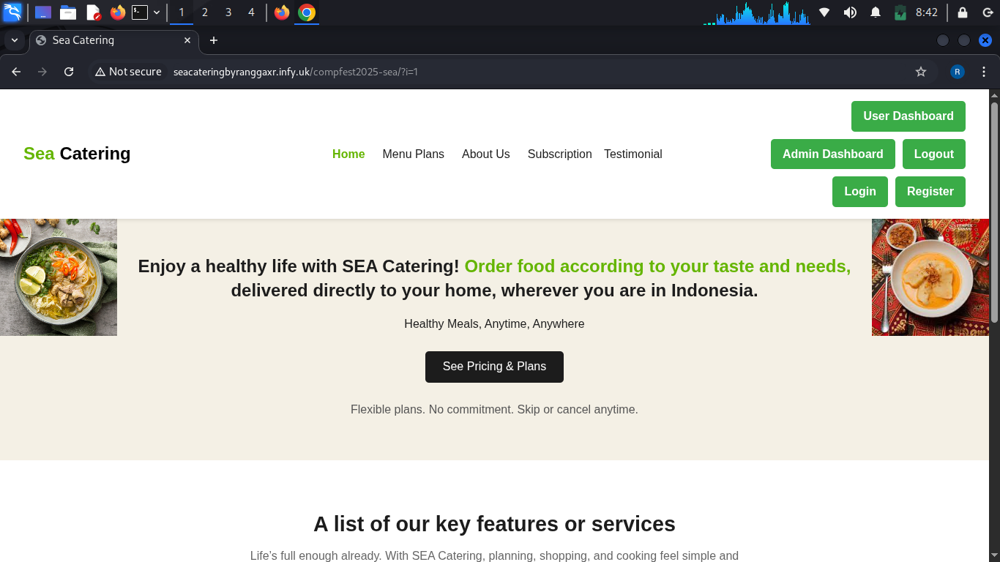

# 🌊 Sea Catering

**Sea Catering** adalah platform katering online sehat yang memungkinkan pengguna memesan makanan bergizi, disesuaikan dengan selera dan kebutuhan mereka. Dirancang untuk memberikan kemudahan, keamanan, dan fleksibilitas, Sea Catering menghadirkan solusi praktis untuk hidup sehat, di mana pun Anda berada.



---

## 🚀 Fitur Unggulan

- ✅ **Anti SQL Injection dan XSS**  
  Input pengguna disanitasi dan divalidasi untuk mencegah serangan keamanan.

- 🔐 **JWT (JSON Web Token)**  
  Autentikasi berbasis token untuk menjaga sesi pengguna tetap aman.

- 👤 **Login & Register**  
  Sistem autentikasi pengguna dengan validasi sisi klien & server.

- 📦 **Manajemen Langganan**  
  Pengguna dapat memilih, menjeda, atau membatalkan paket berlangganan.

- 🗣️ **Testimoni Pengguna**  
  Pengguna dapat mengirim testimoni dan langsung ditampilkan dari database.

- 🧑‍💼 **User & Admin Dashboard**  
  Area kontrol terpisah untuk pengguna dan admin untuk memantau data.

---

## 🛠️ Teknologi yang Digunakan

- **Frontend**: HTML, CSS, JavaScript  
- **Backend**: PHP  
- **Database**: MySQL  
- **Keamanan**:  
  - Prepared Statements (PDO/MySQLi)  
  - XSS Filtering  
  - JWT (JSON Web Token)

---

## 📁 Struktur Folder

```text
Sea-Catering/
├── index.html
├── login.html
├── login.php
├── register.html
├── register.php
├── admin_dashboard.php
├── user_dashboard.php
├── subscription.php
├── submit_subscription.php
├── pause_subscription.php
├── cancel_subscription.php
├── testimonial.php
├── submit_testimonial.php
├── mealplans.html
├── styles.css
├── Screenshot_2025-07-16_08_42_20.png
├── LICENSE
├── README.md
└── images/
    ├── steakayam.jpg
    ├── protein.jpg
    ├── balancedplan.jpeg
    ├── healthyplan.jpeg
    ├── kontainer.jpg
    ├── colaborative kitchen dapur bersama.png
    └── images.jpeg
```
## Instalasi Lokal

    Clone repositori ini:

``` bash
git clone https://github.com/username/sea-catering.git
cd sea-catering
```
Import database:
Jika tersedia file database.sql, import ke MySQL melalui phpMyAdmin atau terminal.

Jalankan server lokal (XAMPP, Laragon, dsb):
Letakkan folder proyek di dalam folder htdocs.

Akses di browser:
```bash
http://localhost/sea-catering/index.html
```
